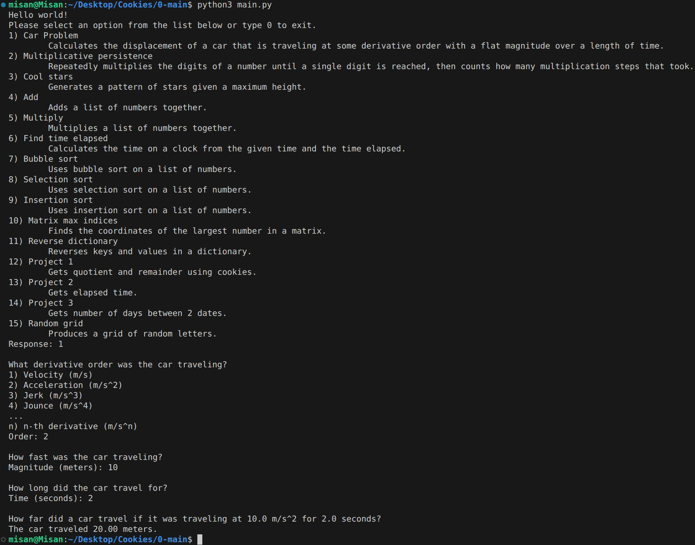

# Main
> Cookies/0-main/

This is my first Python project. It contains a collection of utility functions for various mathematical and programming tasks.

## Usage
Run `python main.py`

### Example

## Functions
- **Car Problem (1)** - Calculates the displacement of a car traveling at a specified derivative order with a flat magnitude over time
- **Multiplicative persistence (2)** - Repeatedly multiplies digits until a single digit, counting the steps
- **Cool stars (3)** - Generates a star pattern with specified height
- **Add (4)** - Adds a list of numbers together
- **Multiply (5)** - Multiplies a list of numbers together
- **Find time elapsed (6)** - Calculates clock time after elapsed duration
- **Bubble sort (7)** - Sorts numbers using bubble sort algorithm
- **Selection sort (8)** - Sorts numbers using selection sort algorithm  
- **Insertion sort (9)** - Sorts numbers using insertion sort algorithm
- **Matrix max indices (10)** - Finds coordinates of the largest number in a matrix
- **Reverse dictionary (11)** - Reverses keys and values in a dictionary
- **Project 1 (12)** - Gets quotient and remainder using division
- **Project 2 (13)** - Gets elapsed time calculation
- **Project 3 (14)** - Gets number of days between two dates in a year
- **Random grid (15)** - Produces a grid of random letters

Make sure [Python](https://www.python.org/downloads/) is installed on your device before running this file.
