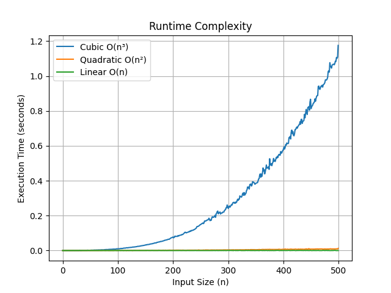

# Cookies/Sequential-Sum

A simple Python script that demonstrates **runtime complexity** using three different algorithms to calculate the **largest contiguous sum** in a list of integers.

This script includes:
- A **cubic** \( O(n^3) \) implementation  
- A **quadratic** \( O(n^2) \) implementation  
- A **linear** \( O(n) \) implementation (Kadane's Algorithm)

## 📊 Graph Output

Below is a sample graph (`screenshot.png`) showing the runtime differences between the three algorithms as input size increases:

Make sure [Python](https://www.python.org/downloads/ "Download Python from www.python.org") is installed on your system.
